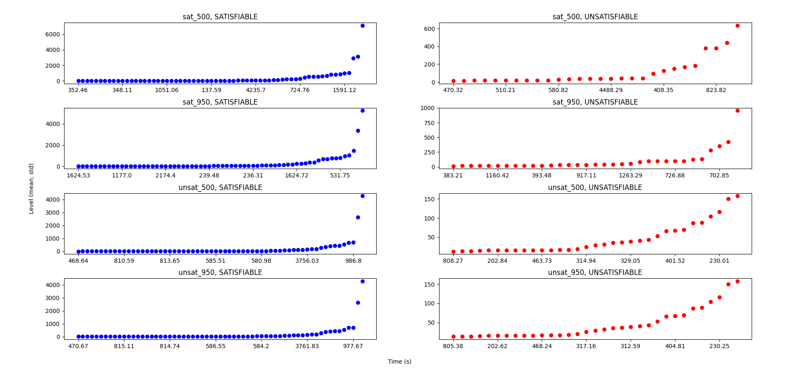
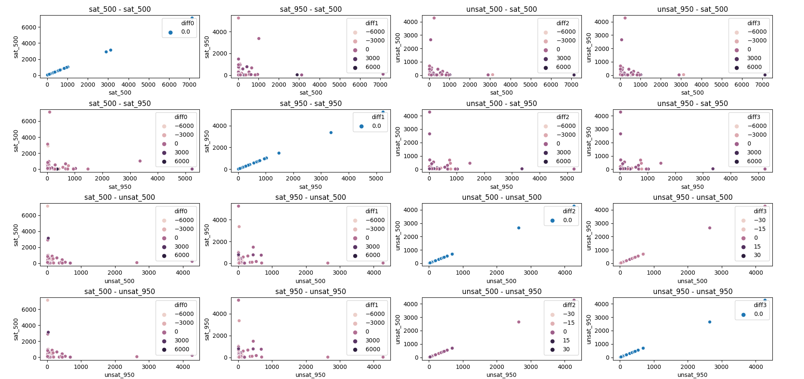
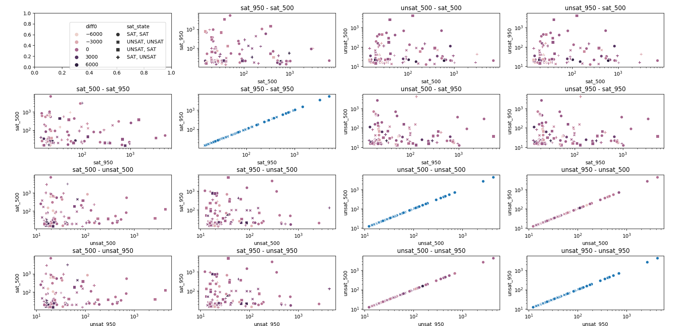

### Sorted level plots of all configurations
(Left (blue) for SAT; Right (red) UNSAT)

### Scatter level plots of each pair of configurations
with heat coding based on difference in solve time

#### Same as above but in logscale

-------------------------------------------------------
## Older plots

### Level vs. solve time

### Box plots of time and average level for SAT and UNSAT formulas

### Box plots of difference in time per CNF

