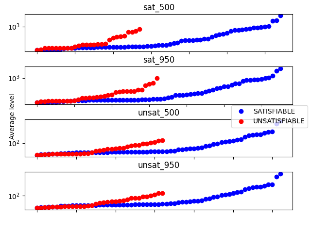

### Sorted level plots of all configurations
(Left (blue) for SAT; Right (red) UNSAT)

### Scatter level plots (logscale) of each pair of configurations
with heat coding based on difference in solve time

