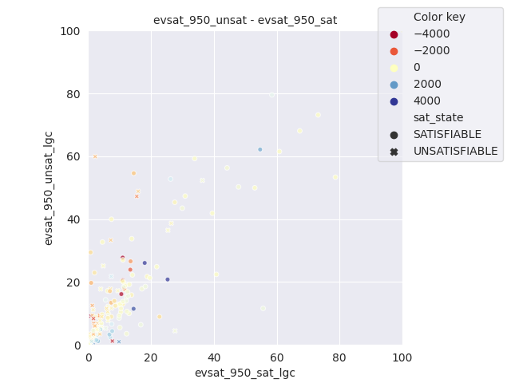
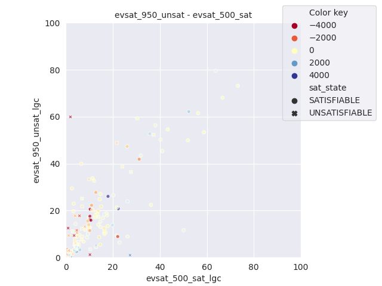

### Plots of LGC (percentage of low glue conflicts)

### Scatter lgc plots of each pair of configurations
with heat coding based on difference in solve time

---------------------------------------------------------------

## Updated glue plots

---------------------------------------------------------------

## Updated level plots

