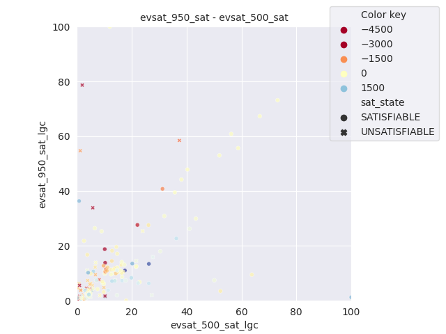
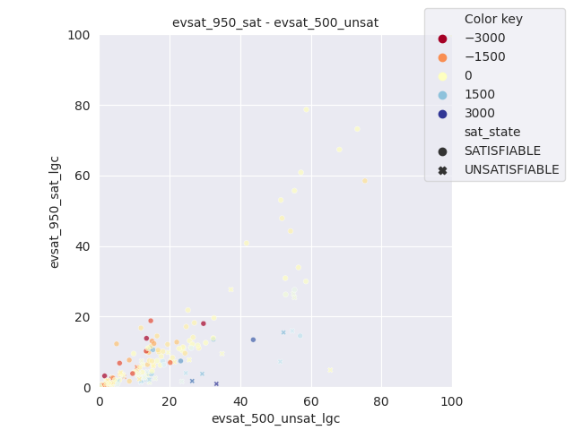
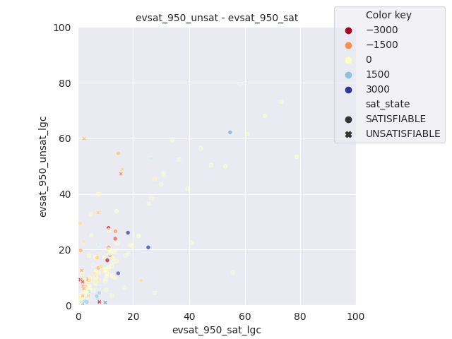
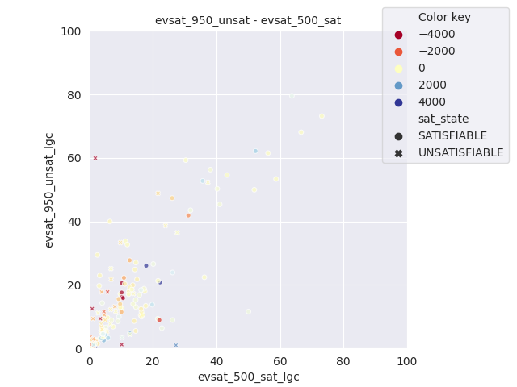
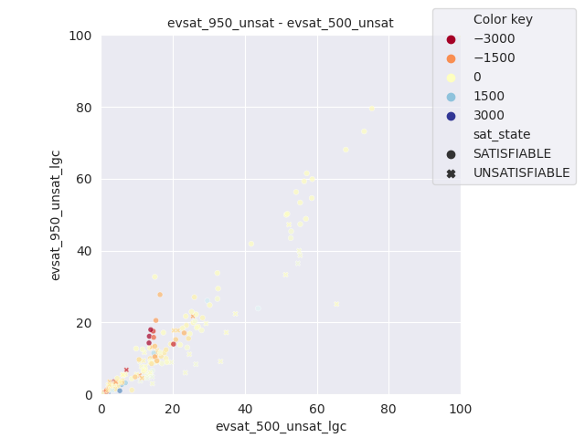

### Cadical with and without dynamic decay factor selection based on LGC

---------------------------------------------------------------
### Plots of LGC (percentage of low glue conflicts)

### Scatter lgc plots of each pair of configurations
with heat coding based on difference in solve time

